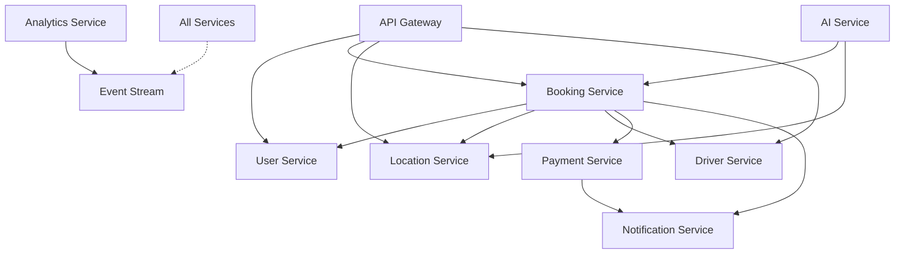

# Microservices Architecture - Interstate Cab Booking

## 🏗️ Architecture Overview

### Design Principles
1. **Domain-Driven Design (DDD)** - Services aligned with business capabilities
2. **Database per Service** - Each service owns its data
3. **API-First Design** - Well-defined contracts between services
4. **Event-Driven Architecture** - Asynchronous communication via Kafka
5. **Fault Tolerance** - Circuit breakers, retries, and fallbacks
6. **12-Factor App** - Cloud-native best practices

## 🔧 Microservices Breakdown

### 1. User Service
**Responsibilities:**
- User registration and authentication
- Profile management
- OAuth integration (Google, Facebook, etc.)
- JWT token generation and validation
- Role-based access control (RBAC)

**Technology Stack:**
- Language: Python (FastAPI)
- Database: PostgreSQL
- Cache: Redis
- Port: 8001

### 2. Booking Service
**Responsibilities:**
- Ride booking management
- Ride status tracking
- Pricing calculation
- Driver assignment
- Ride history

**Technology Stack:**
- Language: Python (FastAPI)
- Database: MongoDB
- Cache: Redis
- Port: 8002

### 3. Location Service
**Responsibilities:**
- City management
- Distance calculation
- Route optimization
- Geocoding services
- Real-time location updates

**Technology Stack:**
- Language: Python (FastAPI)
- Database: MongoDB
- Cache: Redis
- Port: 8003

### 4. Driver Service
**Responsibilities:**
- Driver registration
- Driver profiles
- Availability management
- Location tracking
- Performance metrics

**Technology Stack:**
- Language: Go (Gin/Fiber)
- Database: PostgreSQL
- Cache: Redis
- Port: 8004

### 5. Payment Service
**Responsibilities:**
- Payment processing
- Wallet management
- Transaction history
- Refunds and disputes
- Billing and invoicing

**Technology Stack:**
- Language: Go (Gin)
- Database: PostgreSQL
- Message Queue: RabbitMQ
- Port: 8005

### 6. Notification Service
**Responsibilities:**
- Email notifications
- SMS notifications
- Push notifications
- In-app notifications
- Notification templates

**Technology Stack:**
- Language: Node.js (Express)
- Database: MongoDB
- Message Queue: Kafka
- Port: 8006

### 7. AI Service
**Responsibilities:**
- Chatbot functionality
- Ride recommendations
- Demand prediction
- Dynamic pricing ML models
- Natural language processing

**Technology Stack:**
- Language: Python (FastAPI)
- Database: MongoDB
- Vector DB: ChromaDB
- Cache: Redis
- Port: 8007

### 8. Analytics Service
**Responsibilities:**
- Business metrics
- User behavior analytics
- Performance monitoring
- Custom reports
- Data aggregation

**Technology Stack:**
- Language: Python (FastAPI)
- Database: ClickHouse
- Cache: Redis
- Port: 8008

### 9. Admin Service
**Responsibilities:**
- Admin dashboard API
- System configuration
- User management
- Content management
- Monitoring endpoints

**Technology Stack:**
- Language: Node.js (NestJS)
- Database: PostgreSQL
- Port: 8009

## 🌐 API Gateway

### Kong API Gateway
- **Port:** 8000
- **Features:**
  - Request routing
  - Authentication
  - Rate limiting
  - Load balancing
  - Request/Response transformation
  - Monitoring and analytics

## 📨 Message Broker

### Apache Kafka
- **Event Topics:**
  - `user.events` - User registration, updates
  - `booking.events` - Booking created, updated, completed
  - `payment.events` - Payment success, failure
  - `location.events` - Location updates
  - `notification.events` - Notification triggers

## 🗄️ Data Management

### Databases
1. **PostgreSQL** - User, Driver, Payment data
2. **MongoDB** - Bookings, Locations, Notifications
3. **Redis** - Caching, Sessions, Real-time data
4. **ClickHouse** - Analytics and time-series data
5. **ChromaDB** - Vector embeddings for AI

### Data Patterns
- **Saga Pattern** - Distributed transactions
- **Event Sourcing** - Audit trail
- **CQRS** - Command Query Responsibility Segregation
- **CDC** - Change Data Capture for sync

## 🔒 Security

### Service-to-Service Communication
1. **mTLS** - Mutual TLS for internal communication
2. **Service Mesh** - Istio for advanced traffic management
3. **API Keys** - For service authentication
4. **OAuth 2.0** - For external API access

### API Security
1. **JWT Tokens** - User authentication
2. **API Rate Limiting** - DDoS protection
3. **CORS** - Cross-origin policies
4. **Input Validation** - Request sanitization

## 📊 Observability

### Monitoring Stack
1. **Prometheus** - Metrics collection
2. **Grafana** - Metrics visualization
3. **ELK Stack** - Logging (Elasticsearch, Logstash, Kibana)
4. **Jaeger** - Distributed tracing
5. **AlertManager** - Alert management

## 🚀 Deployment

### Container Orchestration
- **Kubernetes** - Production
- **Docker Compose** - Development
- **Helm Charts** - K8s package management

### CI/CD Pipeline
1. **GitHub Actions** - CI/CD automation
2. **ArgoCD** - GitOps deployment
3. **Harbor** - Container registry
4. **SonarQube** - Code quality

## 🔄 Service Communication Patterns

### Synchronous
- **REST APIs** - HTTP/HTTPS
- **gRPC** - High-performance RPC
- **GraphQL** - Flexible queries

### Asynchronous
- **Event Streaming** - Kafka
- **Message Queues** - RabbitMQ
- **Webhooks** - Event notifications

## 📋 Implementation Phases

### Phase 1: Core Services (Week 1-2)
- [ ] User Service
- [ ] Booking Service
- [ ] Location Service
- [ ] API Gateway setup

### Phase 2: Supporting Services (Week 3-4)
- [ ] Payment Service
- [ ] Notification Service
- [ ] Driver Service

### Phase 3: Advanced Services (Week 5-6)
- [ ] AI Service
- [ ] Analytics Service
- [ ] Admin Service

### Phase 4: Infrastructure (Week 7-8)
- [ ] Service Mesh
- [ ] Monitoring Stack
- [ ] CI/CD Pipeline
- [ ] Security hardening

## 🧩 Shared Libraries

### Common Packages
1. **auth-lib** - JWT validation, RBAC
2. **logger-lib** - Structured logging
3. **tracer-lib** - Distributed tracing
4. **error-lib** - Error handling
5. **validator-lib** - Input validation
6. **kafka-lib** - Event publishing

## 🔗 Service Dependencies

## 🚦 Service Health Checks

Each service exposes:
- `/health` - Basic health check
- `/ready` - Readiness probe
- `/metrics` - Prometheus metrics
- `/version` - Service version info

## 🔐 Environment Configuration

### Environment Variables
- `SERVICE_NAME` - Unique service identifier
- `SERVICE_PORT` - Service port
- `DB_CONNECTION` - Database connection string
- `REDIS_URL` - Redis connection
- `KAFKA_BROKERS` - Kafka broker list
- `JWT_SECRET` - JWT signing key
- `LOG_LEVEL` - Logging level

## 📚 API Documentation

- **OpenAPI/Swagger** - REST API docs
- **gRPC Reflection** - gRPC service discovery
- **AsyncAPI** - Event documentation
- **Postman Collections** - API testing

## 🎯 Benefits of This Architecture

1. **Scalability** - Scale services independently
2. **Resilience** - Fault isolation
3. **Flexibility** - Technology diversity
4. **Maintainability** - Smaller, focused codebases
5. **Team Autonomy** - Independent deployments
6. **Performance** - Optimized for specific tasks

## ⚠️ Challenges and Solutions

### Challenges
1. **Distributed Transactions** → Saga Pattern
2. **Service Discovery** → Consul/Kubernetes DNS
3. **Data Consistency** → Event Sourcing
4. **Network Latency** → Service Mesh optimization
5. **Debugging** → Distributed Tracing

### Anti-Patterns to Avoid
1. **Chatty Services** - Minimize inter-service calls
2. **Shared Databases** - Each service owns its data
3. **Synchronous Everything** - Embrace async patterns
4. **Missing Monitoring** - Observability from day one
5. **Tight Coupling** - Use events for loose coupling
